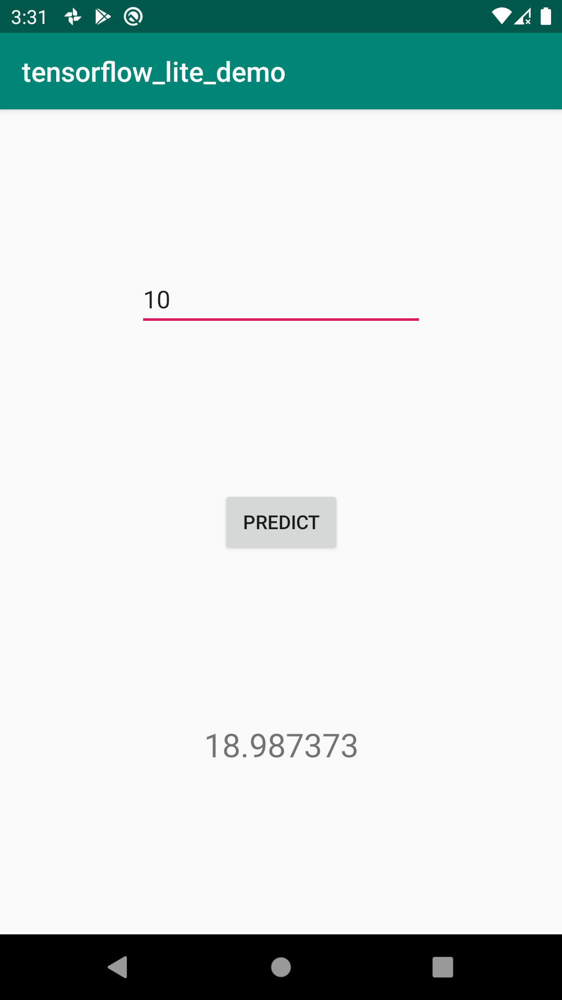
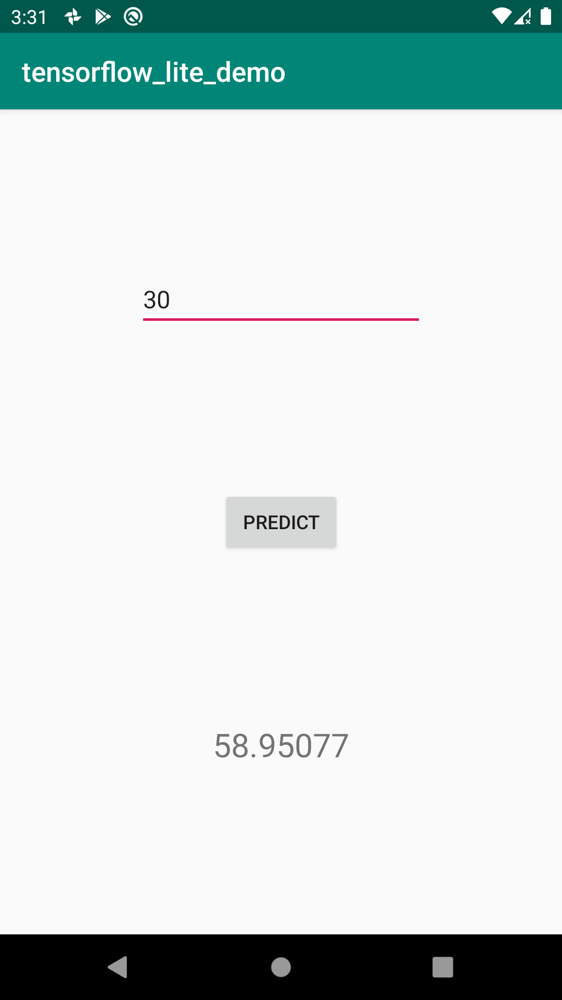
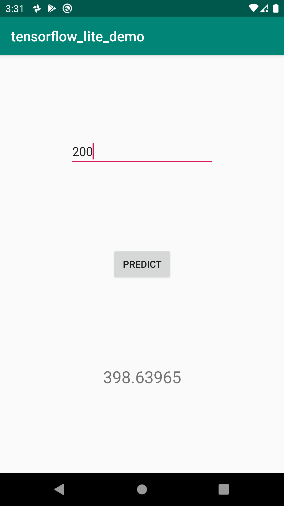

# Linear-App
### An ANN model is build and trained and exported to tflite format. Then it is integrated to Android App.

### 👉 If you like this repo then please give it a ⭐️

## Screenshots

## To test this out
Testing this is as simple as it gets. Follow this steps:
1. Clone this project.
2. Open Android Studio
3. Run this app by starting an AVD/use an emulator.
4. After Installation of the app, you can use it. 

## Pull Request

Pull Requests are welcome. Please follow these rules for the ease of understanding:
* Make sure to check for available issues before raising one
* Give me a maximum of 24-48 hours to respond
* Have proper documentation on the parts you are changing/adding

## Developed & Maintained by

[👨 Sayan Nath](https://sayan-nath.web.app/) 
[📷 Insta](https://www.instagram.com/sayannath235/) 
[🐤 Twitter](https://twitter.com/SayanNa20204009) 
[🧳 LinkedIn](https://www.linkedin.com/in/sayan-nath-15a989182/)
 

